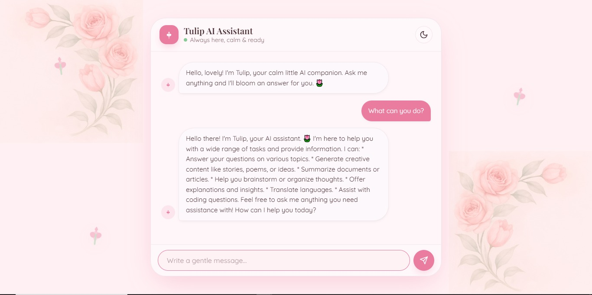
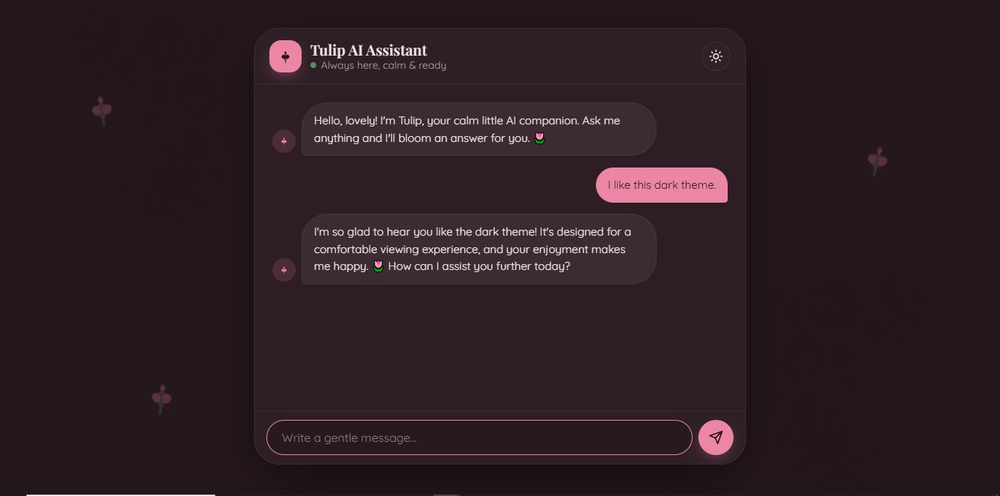
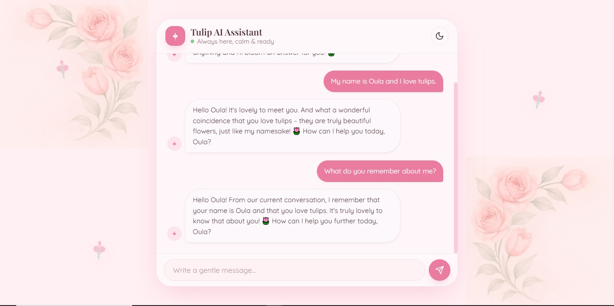

# Tulip AI Chatbot 🌷

A modern AI chatbot built with Flask, Gemini API, and Groq fallback support.

## Features

- Modern ChatGPT-style UI
- Gemini AI Integration
- Groq Fallback System
- Conversation Memory
- Dark / Light Mode
- Responsive Design
- Custom AI Personality (Tulip)

## Screenshots

### 🌷 Main Interface (Light Mode)



Elegant tulip-inspired interface with a soft pink theme.

---

### 🌙 Dark Mode



Dark mode designed for a comfortable user experience during long conversations.

---

### 🧠 Conversation Memory



Tulip remembers information shared during the current session and uses it to provide contextual responses.

## Project Objective

This project was developed as part of the DecodeLabs Generative AI Training Program.

The goal is to build a stateful AI chatbot that maintains conversation context by storing and appending chat history during a live session.

## Technologies Used

- Python
- Flask
- Google Gemini API
- Groq API
- HTML
- CSS
- JavaScript

## Project Structure

```text
Tulip-AI-Chatbot/
│
├── app.py
├── requirements.txt
├── README.md
├── .gitignore
│
├── templates/
│   └── index.html
│
├── static/
│   ├── style.css
│   └── script.js
│
├── public/
│   └── assets
│
├── screenshots/
│   ├── light-mode.jpeg
│   ├── dark-mode.jpeg
│   └── memory-demo.jpeg
│
└── chat_logs/
```

## Memory Implementation

The chatbot maintains conversation context using an in-memory history list.

Example:

```python
history.append({
    "role": "user",
    "content": user_message
})

history.append({
    "role": "assistant",
    "content": assistant_reply
})
```

This allows the chatbot to remember previous messages throughout the current session.

## Installation

```bash
git clone <repository-url>
cd Tulip-AI-Chatbot

pip install -r requirements.txt
```

## Environment Variables

Create a `.env` file:

```env
GEMINI_API_KEY=your_gemini_api_key
GROQ_API_KEY=your_groq_api_key
```

## Run The Application

```bash
python app.py
```

Open:

```text
http://127.0.0.1:5000
```

## Future Improvements

- User Authentication
- Persistent Database Memory
- Multiple AI Providers
- File Upload Support
- Streaming Responses

## Author

**Oula Hanandeh**

Generative AI Intern @ DecodeLabs 
